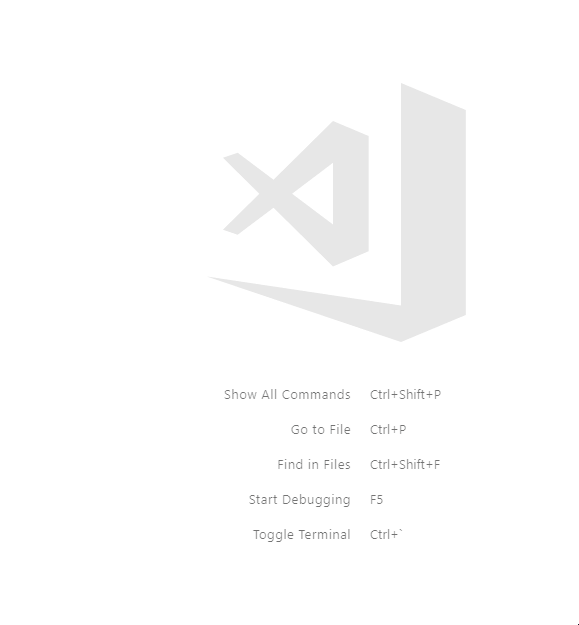

# Localize Lens

Localize Lens is an extension for the AL language. It exists to help with code refactoring. It uses the language implemented symbols and references to verify if a function should be local or not.

## Features

Localize Lens adds a secondary code lens to procedures that are global. It identifies if a function could be local, i.e. it lacks external references.

It has a quick action that can add a local identifier to the procedure.

## Requirements

The extension works based on the symbols and references provided by the [AL Language](https://marketplace.visualstudio.com/items?itemName=ms-dynamics-smb.al). I cannot predict behaviour with this.

## Installation

Install through Visual Studio Code Marketplace. The extension is called "Localize Lens".

It supports the following file extensions:
.al

## Extension Settings

None.

## Known Issues

To provide the code lenses with sufficient speed, the following two issues are moved to the resolution of it instead, and as such, are limitations:
- Procedures with no references will receive a marker.
- Global procedures with external references will receive a marker.

## Release Notes

### 1.0.0

Initial release.

## Acknowledgements

This extension was only possible because I used the following as a reference:
- [ASM Code Lens](https://github.com/maziac/asm-code-lens/) by [maziac](https://github.com/maziac)